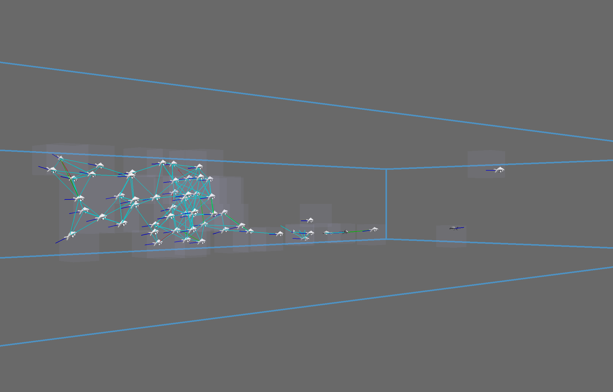

# About

## Goal

This project aims at simulating a group of fish swiming in a tank.

The swarm model is taken from this [paper](https://www.sciencedirect.com/science/article/abs/pii/S0022519302930651?via%3Dihub) that also proposes a [2D simulator](https://www.complexity-explorables.org/explorables/flockn-roll/).

The idea is to produce something similar but in a 3D scene where user can "swim with the fishes".

## 3D Rendering

This project uses [Panda3D](https://www.panda3d.org/) and python:

 - seems to be performant enough
 - easy to reuse 3D assets from Blender (GLTF)

# Run

## Setup Virtual Environment (Recommended)

It's recommended to use a virtual environment to avoid dependency conflicts:

```bash
# Create a virtual environment
python3 -m venv venv

# Activate the virtual environment
# On Linux/Mac:
source venv/bin/activate
# On Windows:
# venv\Scripts\activate

# Install dependencies
pip install numpy panda3d
```

## Install needed packages

If not using a virtual environment, install directly:

```bash
pip install numpy panda3d
```

Note: The project has been tested with Panda3D 1.10.15 and Python 3.12.

## Execute

```bash
python3 swarm.py
```

## Controls

### Camera Movement
- **W/A/S/D** - Move camera forward/left/back/right
- **Arrow Up/Down** - Move camera up/down
- **Arrow Left/Right** - Rotate camera left/right
- **Left Click + Drag** - Pan camera
- **Right Click + Drag** - Rotate camera view

### Simulation Controls
- **SPACE** - Toggle control panel (drawer)
- **P** - Pause/unpause simulation

### Control Panel (press SPACE to show)
The control panel provides buttons for:
- **Free View** - Return to default 3D camera position
- **Top View** - Switch to top-down view
- **Side View** - Switch to side view
- **2D Render** - Toggle orthographic projection
- **Pause** - Pause/unpause the simulation
- **Reset** - Reset fish positions

## Screen shots

### Top view with panel

</img>

### 3D View

</img>


## Known Issues

The original `fish-ani.gltf` model causes a segmentation fault with Panda3D 1.10.15 and Python 3.12 due to GLTF loader compatibility issues. The application now uses `koifish.egg` as a workaround, which is fully compatible.
